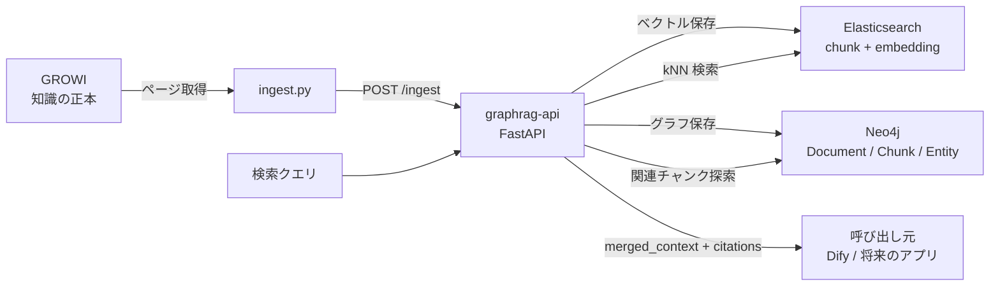
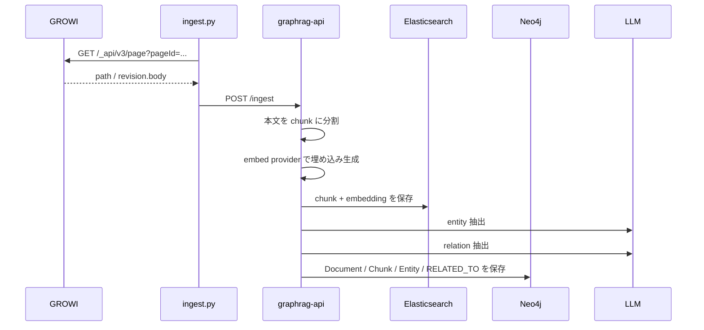

# GraphRAG 学習メモ

[README に戻る](../README.md)

確認日: 2026-03-21 JST

## 先に結論

- このリポジトリの `GraphRAG` は、`GROWI` のページ本文を取り込み、`Elasticsearch` で意味検索し、`Neo4j` でエンティティのつながりをたどって補助コンテキストを集める構成です。
- つまり「全文をそのまま LLM に渡す」のではなく、まず `近い本文チャンク` を探し、次に `関連する概念や人物を共有する別チャンク` を追加する2段階検索です。
- 公式の Microsoft GraphRAG が持つ `Global Search` や `Community Report` まではまだ実装していません。この実装は、GraphRAG の考え方を小さく始める PoC と考えると理解しやすいです。

## この構成の全体像

この構成のポイントは、検索エンジンとグラフDBに役割を分けていることです。

- `Elasticsearch`: 「質問に意味的に近い本文断片を速く探す」
- `Neo4j`: 「その断片が触れているエンティティをたどって、追加で見るべき断片を広げる」

## なぜこの分け方にしているか

### 1. Dify 本体を汚さないため

`dify/docker-compose.yaml` は公式の自動生成ファイルです。そこへ直接書き足すと、Dify 更新時に差分管理が難しくなります。

そのため、このリポジトリでは GraphRAG を `graphrag/docker-compose.yml` に切り出し、Dify とは独立した compose プロジェクトとして管理しています。これは「既存サービスはなるべくそのまま」「追加機能は別プロジェクトとして閉じ込める」という保守しやすい形です。

### 2. ベクトル検索とグラフ探索は得意分野が違うため

通常の RAG は「ベクトル検索で近いチャンクを取る」までは得意ですが、次のような質問で弱くなりやすいです。

- 同じ人物や組織に関する複数ページを横断したい
- 直接似ていないが、同じ概念でつながる補助情報がほしい
- 「このページと関係が深い別ページ」を説明可能な形で取りたい

そこでこの実装では、`Elasticsearch` を一次検索、`Neo4j` を二次探索にしています。

## ファイルごとの役割

| ファイル | 役割 |
|---|---|
| `graphrag/docker-compose.yml` | GraphRAG 専用の ES / Kibana / Neo4j / API を起動する |
| `graphrag/main.py` | `/ingest` と `/search` を提供する GraphRAG API 本体 |
| `graphrag/providers.py` | Bedrock / Ollama の切り替えを隠す抽象レイヤー |
| `graphrag/ingest.py` | GROWI のページを取得して GraphRAG API に送る CLI |
| `graphrag/Dockerfile` | GraphRAG API をコンテナ化する |

## この実装での取り込みフロー

`/ingest` の中でやっていることは次の順番です。

1. GROWI のページ本文を受け取る
2. 本文を小さなチャンクへ分割する
3. 各チャンクの埋め込みベクトルを作る
4. チャンク本文とベクトルを Elasticsearch に保存する
5. チャンクからエンティティを抽出する
6. エンティティ間の関係を抽出する
7. `Document -> Chunk -> Entity` のつながりを Neo4j に保存する

## この実装での検索フロー

検索は「最初に近いものを探す」「あとから関連情報を広げる」の2段階です。

1. ユーザーの質問を埋め込みベクトルにする
2. `Elasticsearch` に `knn` 検索を投げて、近いチャンクを `top_k` 件取得する
3. そのチャンクが `MENTIONS` していた `Entity` を `Neo4j` でたどる
4. 同じ `Entity` に触れている別チャンクを追加候補として取る
5. 重複を除いて `merged_context` を作る
6. 出典として `citations` を返す

必要に応じて `category` を渡すと、特定カテゴリに絞って検索できます。

ここで重要なのは、`Neo4j` は最初から全件探索していないことです。まず `Elasticsearch` の近傍検索で「検索の起点」を絞ってから、そこに関連するグラフだけを触っています。これで PoC としてはシンプルで理解しやすい構成になります。

## 一般的な GraphRAG との関係

### このリポジトリの GraphRAG

- 文書をチャンク化して埋め込み検索する
- 各チャンクから `Entity` と `Relation` を抽出する
- グラフをたどって関連チャンクを追加する
- 返り値は `merged_context` と `citations`

### Microsoft GraphRAG 公式の典型像

- インデックス作成時に知識グラフや要約群を生成する
- `Local Search` では知識グラフとテキストチャンクを組み合わせる
- `Global Search` ではコミュニティレポートを map-reduce 的に使って全体テーマを答える

### Neo4j 公式 GraphRAG の典型像

- Neo4j を中心にベクトル検索や Cypher 検索を組み合わせる
- `HybridRetriever` や `HybridCypherRetriever` のように、近いノードを取った後にグラフをたどる設計がある

## 「何がまだ未実装か」を理解すると全体像がつかみやすい

この PoC は十分に学習価値がありますが、GraphRAG の完成形ではありません。特に次の点は未実装です。

- グラフ探索は固定 1 ホップ（`graph_hops` パラメータは削除済み。可変ホップを実装するには Cypher の可変長パターンと探索範囲の設計が必要）
- エンティティの名寄せは `canonical_name` ベースの簡易実装
- 関係抽出は LLM の JSON 出力品質に依存
- ES と Neo4j の旧チャンク削除は最終的な整合性を目指す設計（ES 削除失敗時は再取り込みで修復）
- Microsoft GraphRAG の `Global Search` や `Community Report` 相当は未実装

## 読み方のコツ

初心者向けには、次の順で読むと理解しやすいです。

1. `graphrag/docker-compose.yml`
どのコンテナが追加されているかを見る

2. `graphrag/ingest.py`
どこから本文が来るかを見る

3. `graphrag/main.py` の `/ingest`
保存時の流れをつかむ

4. `graphrag/main.py` の `/search`
検索時の流れをつかむ

5. `graphrag/providers.py`
Bedrock / Ollama の差し替えポイントを理解する

## 運用上の注意

### 埋め込みモデルを変えると再取り込みが必要

`Elasticsearch` の `dense_vector` は次元数を固定して持ちます。そのため `Titan Embed v2 (1024 次元)` から `nomic-embed-text (例: 768 次元)` に切り替えると、インデックスを作り直して再取り込みが必要です。

### GraphRAG の品質は LLM 抽出品質に引っ張られる

この実装では、エンティティ抽出と関係抽出を LLM に任せています。つまり「検索品質」は埋め込みモデルだけでなく、抽出用 LLM がどれだけ安定して JSON を返し、どれだけ素直に関係を見つけられるかにも依存します。

### GROWI API はバージョン差分に注意

GROWI 公式ドキュメントでは、`/_api/v3` 系 API のレスポンス構造に変更が入ることがあります。`ingest.py` は `page.revision.body` を前提にしているため、GROWI を上げたときは API レスポンスを確認した方が安全です。

## 次にやると学びが深まること

- `/search` の Cypher を 2 ホップ対応にする
- `RELATED_TO` を全部同じラベルで持つのではなく、型ごとに整理する
- Dify から `graphrag-api` を呼ぶワークフローを作る
- 更新時に `document_id` 単位で再取り込みできるようにする
- 高レベル要約用に Microsoft GraphRAG 的な集約層を別途追加する

## 参考リンク

この資料の一般論は、以下の一次情報を基に整理しています。

- Microsoft GraphRAG Query Overview: https://microsoft.github.io/graphrag/query/overview/
- Microsoft GraphRAG Local Search: https://microsoft.github.io/graphrag/query/local_search/
- Microsoft GraphRAG Global Search: https://microsoft.github.io/graphrag/query/global_search/
- Microsoft GraphRAG Getting Started: https://microsoft.github.io/graphrag/get_started/
- Neo4j GraphRAG for Python: https://neo4j.com/docs/neo4j-graphrag-python/current/
- Neo4j GraphRAG User Guide: RAG: https://neo4j.com/docs/neo4j-graphrag-python/current/user_guide_rag.html
- Elasticsearch kNN search: https://www.elastic.co/docs/solutions/search/vector/knn
- GROWI API Docs: https://docs.growi.org/en/api/
- GROWI REST API v3: https://docs.growi.org/redoc-apiv3.html
- GROWI v4.5 API response structure changes: https://docs.growi.org/ja/admin-guide/upgrading/45x.html
